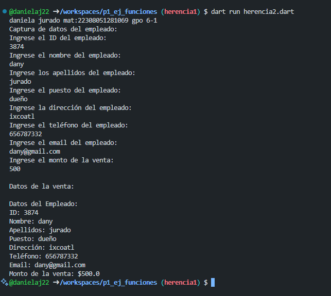

crear la clase empleados con los atributos (id empleado, nombre,puesto,direccion,telefono, email, apellidos)con la funcion capturadatos(), con interaccion de interfaz de usuario. crear la clase ventacon herencia a empleados y una funcion mostrar datos().lenguaje dart

salida de resultados
